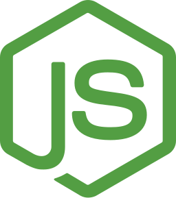

<div align="center">
  
  <h3>A Node.js RESTful API</h3>

  <p align="center">
    API RESTful desenvolvida no Node.js utilizando o método 🔒 autenticação <a href="https://jwt.io/">jsonwebtoken</a> <br/>tecnologias: TypeScript, PostgresSQL...
  </p>  
</div>

<div align="center">
  

   

  

  
</div>

<p align="center"><small>Build with ❤️ by: <a href="">José Lucas</a></small></p>

## :wrench: Como executar no ambiente local?

### :information_source: Requisitos mínimos

1. NodeJS na versão **14.x** ou superior
2. Gerenciadores de pacotes como: yarn ou npm

#### Configurações do ambiente

- Antes de iniciar o servidor de desenvolvimento
  é necessário configurar algumas variáves de ambiente. Crie um arquivo chamado `.env` na raiz do projeto, copie o conteúdo do `.env.example` para o `.env` em seguinda preencha os seus valores.

- Não esqueça de adicionar as credenciais de acesso ao banco de dados no arquivo
  `ormconfig.json` que serão utilizadas pelo TypeORM. [O que é ORM?, mais detalhes](https://pt.wikipedia.org/wiki/Mapeamento_objeto-relacional)

### Guia de instalação

1. Faça um clone do repositório através do git, utilize o comando abaixo:

```bash
$ git clone https://github.com/lucasbernardol/nodejs-auth.git
```

2. Instale todas as dependências necessárias com um gerenciador de pacotes
   de sua preferência `yarn` ou `npm`:

```bash
$ yarn install
```

3. Podemos iniciar o servidor de desenvolvimento?
   Execute o seguinte comando no seu terminal `yarn dev`. Você pode criar e
   modificar "scripts" no arquivo `package.json`:

```bash
$ yarn dev
```

### Realizando testes (API)

- Para facilitar os testes na aplicação (API) podemos utilizar softwares como:

| Software (API clients)           | Download                                   |
| -------------------------------- | ------------------------------------------ |
| Insomnia (Open source, Electron) | [Download](https://insomnia.rest/download) |
| Postman                          | [Download](https://www.postman.com/)       |
| Hoppscotch (Online, open source) | [Online](https://hoppscotch.io/pt-br)      |

## :boy: Autor

<table class="author">
  <tr>
    <td align="center">
      <a href="https://github.com/lucasbernardol">
        
        <br/>
        <sub>
          <b>José Lucas</b>
        </sub>
      </a>
    </td>
  </tr>
</table>

## 📝 Licença

Possui a licença MIT, veja o arquivo [LICENÇA](LICENSE.md) para mais informações.
